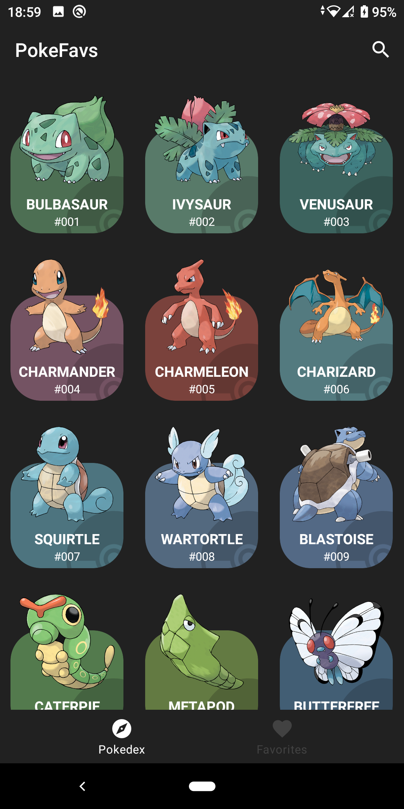
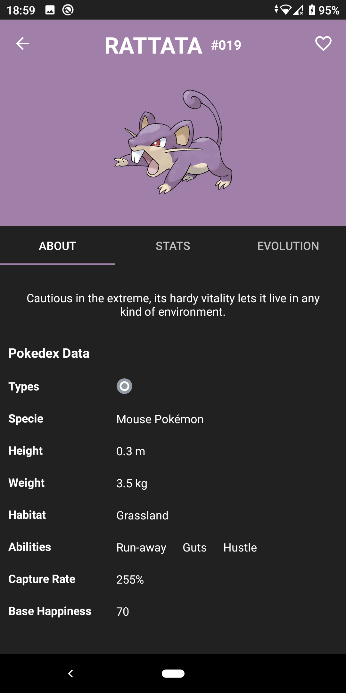
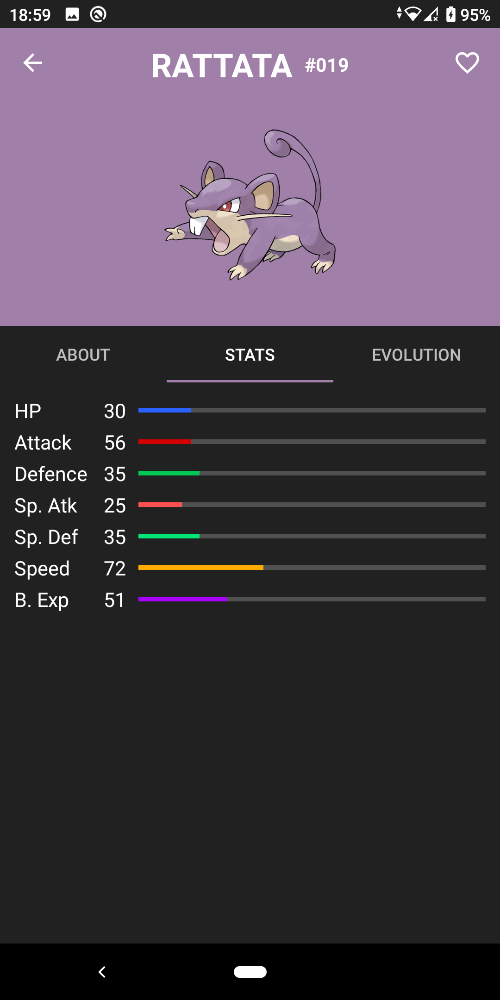
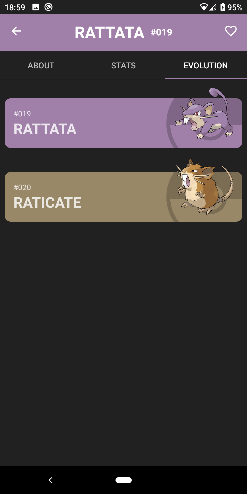
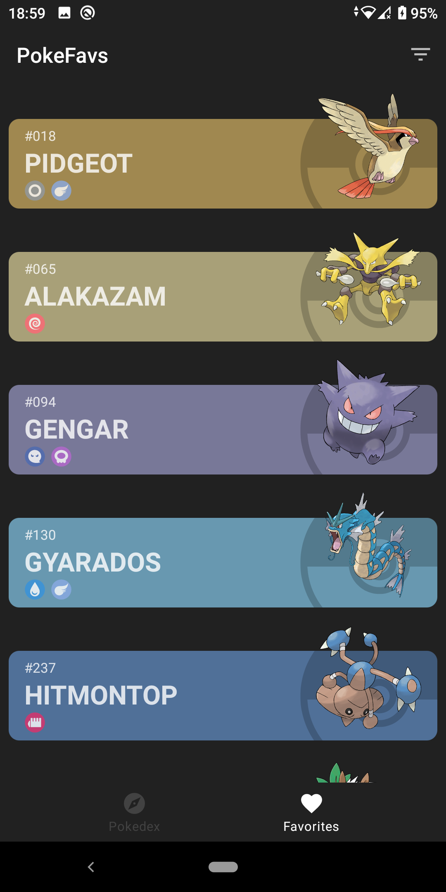

# PokéFavs
_I am current developer student and I developing this app for learning and pratice. Is Pokedex app for Android where you can save you favorites pokemons. I using Android Architecture components and MVVM architecture.
This app was inspired by [jfransp](https://github.com/jfransp/Pokedex) Pokedex application._

## Light Theme
|Pokedex|Details/About|Details/Stats|Details/Evolutions|Favorites|
|------------|-------------|------------|-------------|------------|
|  |  |  |  |  |

## Dark Theme
| Pokedex      | Details/About      | Details/Stats | Details/Evolutions | Favorites  |
|------------|-------------|------------|-------------|------------|
|  |  |  |  |  |

## Built with 🛠️
_I used this libraries:_

* [Kotlin](https://kotlinlang.org/) - 100% write on Kotlin.
* [Retrofit](https://square.github.io/retrofit/) - REST client for consuming APIs.
* [Glide](https://github.com/bumptech/glide) - Used for loading and displaying images
* [OkHttp](https://square.github.io/okhttp/recipes/) - HTTP client.
* [Databinding](https://developer.android.com/topic/libraries/data-binding) - Binds data sources from the provider and consumer together and synchronizes them.
* [Dagger Hilt](https://developer.android.com/training/dependency-injection/hilt-android?hl=es-419) - Dependency injection.
* [Gson](https://github.com/google/gson) - Serialize and deserialize Java objects to (and from) JSON.
* [Paging3](https://developer.android.com/topic/libraries/architecture/paging/v3-overview) - Allow pagination of the Data.
* [LiveData](https://developer.android.com/topic/libraries/architecture/livedata?hl=en) - Data holder class that follows observer pattern.
* [Coroutines](https://developer.android.com/kotlin/coroutines?gclid=CjwKCAiA24SPBhB0EiwAjBgkhnahOjTp9yMMZQzzLzeBydCo2xiD8kzgTNFnJD7aXCuKH9jY6VOmZxoCsPcQAvD_BwE&gclsrc=aw.ds) - Asynchronous programming
* [Flow](https://developer.android.com/kotlin/flow)
* [ViewModel](https://developer.android.com/topic/libraries/architecture/viewmodel?hl=en) - Encapsulate the data for a UI controller to let the data survive configuration changes.
* [ViewPager2](https://developer.android.com/jetpack/androidx/releases/viewpager2) - Display Fragments in a swipeable format.
* [Room](https://developer.android.com/jetpack/androidx/releases/room?hl=en) - Save data in a local database.
* [DataStore](https://developer.android.com/topic/libraries/architecture/datastore?hl=es-419) - Data storage solution that allows you to store key-value pairs or typed objects with protocol buffers
* [RecyclerView](https://developer.android.com/jetpack/androidx/releases/recyclerview?hl=en) - Widget for show list.
* [Swiperefreshlayout](https://developer.android.com/jetpack/androidx/releases/swiperefreshlayout?hl=en) - Refresh the screen manually.
* [Navigation](https://developer.android.com/jetpack/androidx/releases/navigation?hl=en) - Allow users to navigate across, into, and back out
* [Fragment](https://developer.android.com/jetpack/androidx/releases/fragment?hl=en)
* [CardView](https://developer.android.com/jetpack/androidx/releases/cardview?hl=en)

## Open API
Developed on top of the pokeapi.co free to use pokemon data REST Api.

## Architecture
Basic MVVM architecture with repository.

## Future improvements

* Add tests.
* More filters options on favorites list.

## Acknowledgments ❤
* [jfransp](https://github.com/jfransp) - I inspired on you Pokedex app.
* [Douglas Fornaro from dev.to](https://dev.to/douglascf/definitive-guide-to-paging-3-2nh4) - This tutorial helped me to understand and implement the Paging3 library.
