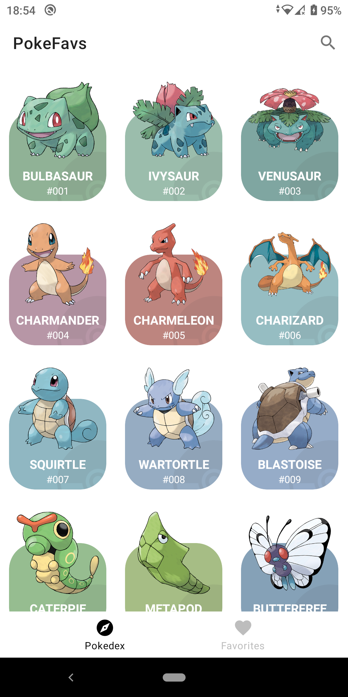
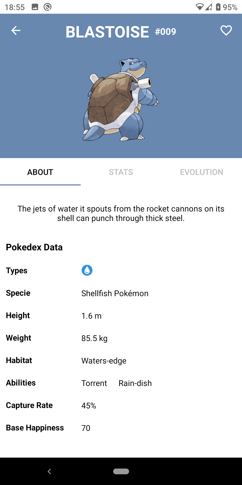
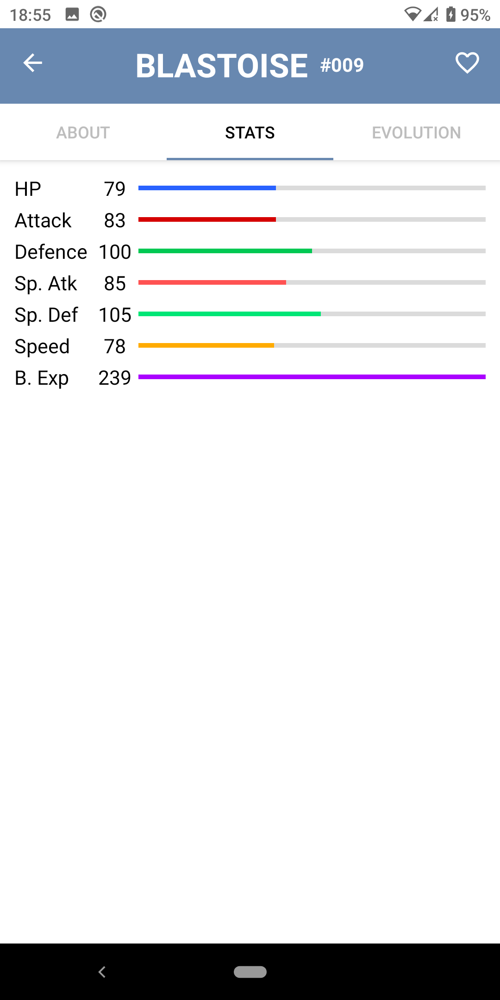
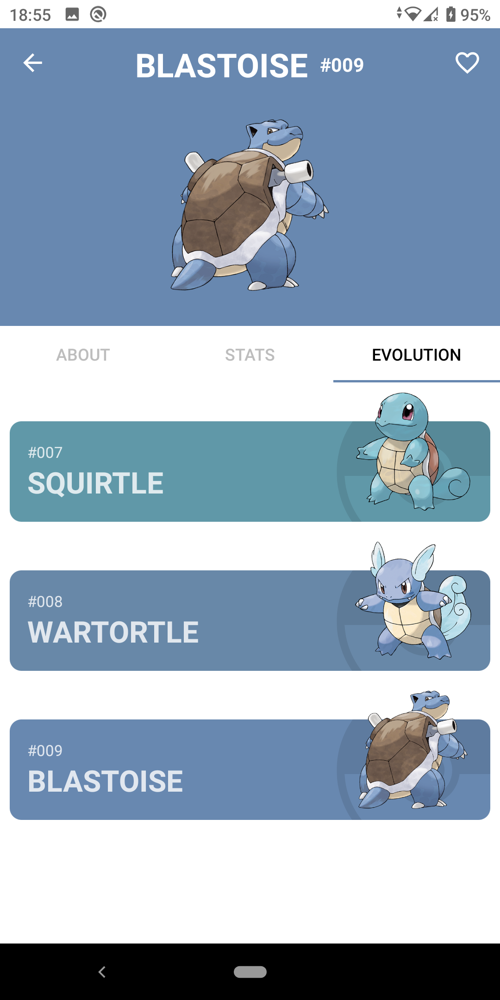
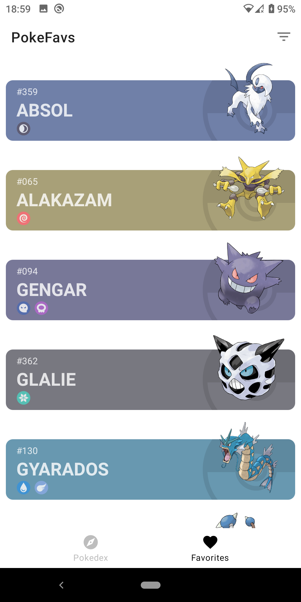

# PokeFavs
_I am current developer student and I developing this app for learning and pratice. Is Pokedex app where you can save you favorites pokemons_

| Pokedex Day      | Details/About      | Details/Stats | Details/Evolutions | Favorites  |
|------------|-------------|------------|-------------|------------|
|  |  |  |  |  |

## Built with 🛠️
_I used:_

* [Kotlin](https://kotlinlang.org/) - 100% write on Kotlin
* [PókeApi](https://pokeapi.co/) - Here I take the data of pokemons
* [Retrofit](https://square.github.io/retrofit/)
* [Glide](https://github.com/bumptech/glide)
* [OkHttp](https://square.github.io/okhttp/recipes/)
* [Jetpack](https://developer.android.com/jetpack)
* [Databinding](https://developer.android.com/topic/libraries/data-binding)
* [Paging](https://developer.android.com/topic/libraries/architecture/paging/v3-overview)
* [LiveData](https://developer.android.com/topic/libraries/architecture/livedata?hl=en)
* [ViewModel](https://developer.android.com/topic/libraries/architecture/viewmodel?hl=en)
* [ViewPager](https://developer.android.com/jetpack/androidx/releases/viewpager?hl=en)
* [Room](https://developer.android.com/jetpack/androidx/releases/room?hl=en)
* [RecyclerView](https://developer.android.com/jetpack/androidx/releases/recyclerview?hl=en)
* [Swiperefreshlayout](https://developer.android.com/jetpack/androidx/releases/swiperefreshlayout?hl=en)
* [Navigation](https://developer.android.com/jetpack/androidx/releases/navigation?hl=en)
* [Fragment](https://developer.android.com/jetpack/androidx/releases/fragment?hl=en)
* [Cardview](https://developer.android.com/jetpack/androidx/releases/cardview?hl=en)

## Acknowledgments ❤

*  - 
